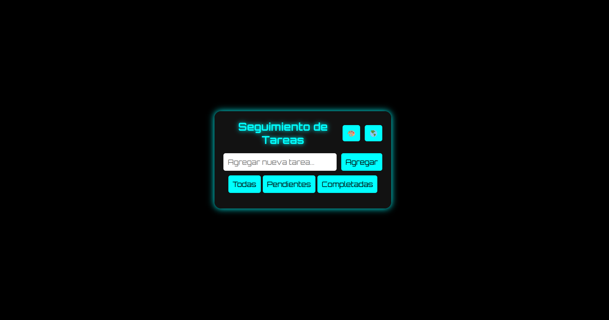
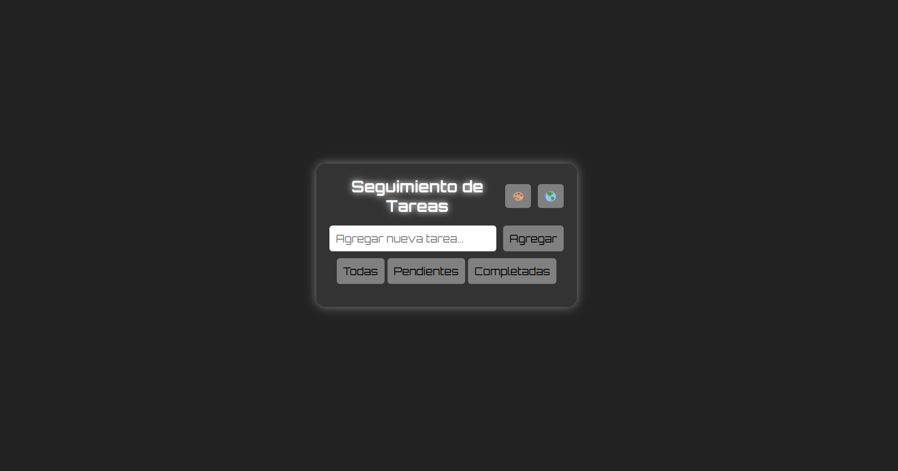
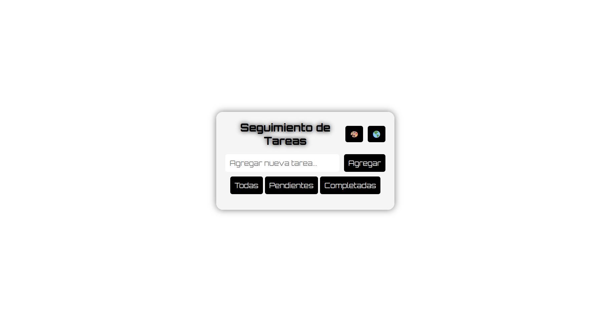

# 📌 Task Tracker
An **intuitive web application** for efficient task management. It allows you to **add, edit, delete, and mark tasks as completed**, as well as offering a **customizable design** with different themes, **multilingual support (Spanish/English)**, and **drag & drop** functionality to reorder tasks.

**🔗 Access the live demo:** [Task Tracker - GitHub Pages](https://taniagredo.github.io/task-tracker/)

## Main Features
- **Add, edit, delete, and mark tasks** as completed or pending.
- **Filter tasks** by status (All, Pending, Completed).
- **Reorder tasks** via drag & drop.
- **Multilingual support (Spanish & English)**.
- **Switch themes:** Neon, Dark, Light.
- **Notifications** for key actions.
- **Local data persistence** using `localStorage`.

## Preview
### ⚡ Neon Mode


### 🌙 Dark Mode


### ☀️ Light Mode


## Install and Use
1. Clone the repository:
   
```sh
git clone https://github.com/taniagredo/task-tracker.git
cd task-tracker
```
2. Just open the `index.html` file in your browser.
3. Switch themes via the 🎨 button and language via the 🌎 button.

## Build With
- [HTML5](https://developer.mozilla.org/en-US/docs/Web/Guide/HTML/HTML5): App structure.
- [CSS3](https://developer.mozilla.org/en-US/docs/Web/CSS): Visual styles and themes.
- [JavaScript](https://developer.mozilla.org/en-US/docs/Web/JavaScript): Interactive features.
- [localStorage](https://developer.mozilla.org/en-US/docs/Web/API/Window/localStorage): Data persistence.

## Contributions
Contributions are welcome! To improve this project:

1. Fork the repository.
2. Create a new branch:

```sh
git checkout -b feature-nueva-funcionalidad
```
   
3. Make your changes and commit them:
   
```sh
git commit -m "Descripción del cambio"
git push origin feature-nueva-funcionalidad
```

4. Submit a Pull Request.

## License
This project is licensed under the [MIT License](https://opensource.org/licenses/MIT). See the [LICENSE](LICENSE) file for more details.
